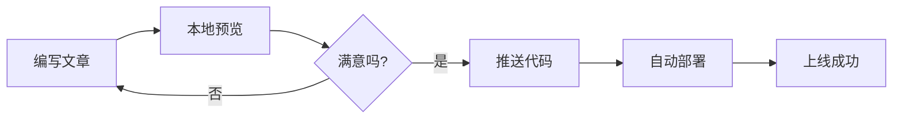

> 本文整合了 astro-koharu 主题自带的所有示例文档内容，形成一份完整的博客搭建与写作指南。所有原始文档已归档在 `src/content/archive/` 目录中。

## 项目概述

**astro-koharu** 是一个基于 Astro 7.x 构建的现代化博客系统，设计灵感来自 Hexo 的 [Shoka](https://github.com/amehime/hexo-theme-shoka) 主题。"Koharu"（小春）寓意晚秋至初冬那段似春天般温暖的晴天。主题采用萌系/二次元风格，粉蓝配色，适合 ACG、前端、手账向个人站。

### 核心特点

- **性能优异** — 基于 Astro 7.x 静态站点生成，加载轻快
- **优雅设计** — 萌系/二次元风格，深色/浅色双主题
- **全站搜索** — 基于 Pagefind 的无后端搜索，支持中文分词
- **丰富 Markdown** — GFM、Mermaid、KaTeX、Shoka 兼容语法、Infographic 信息图
- **多语言 (i18n)** — 内置中/英/日 UI，内容级翻译，hreflang SEO
- **多级分类与标签** — 灵活的嵌套分类，系列文章独立管理
- **智能推荐** — 基于 transformers.js 的本地语义相似度文章推荐
- **AI 摘要** — 自动为文章生成 AI 摘要
- **内容加密** — AES-256-GCM 加密块和整篇文章加密
- **LQIP** — 低质量图片占位符，图片加载前显示渐变色
- **评论系统** — 支持 Waline、Giscus、Remark42、Twikoo 四种方案
- **响应式设计** — 完美适配桌面、平板、移动端
- **Koharu CLI** — 交互式命令行工具，管理备份/还原/更新/内容创建
- **轻量 CMS** — 独立的 Web 管理界面，浏览器内编辑

### 环境要求

| 工具 | 版本要求 |
|------|---------|
| Node.js | >= 22.12.0 |
| pnpm | >= 10.28.2 |

```bash
# 安装 pnpm（如未安装）
npm install -g pnpm
```

---

## 快速开始

### 安装

```bash
# 克隆仓库
git clone https://github.com/cosZone/astro-koharu.git
cd astro-koharu

# 安装依赖
pnpm install

# 启动开发服务器
pnpm dev
# 访问 http://localhost:4321
```

### 可用命令

| 命令 | 说明 |
|------|------|
| `pnpm dev` | 启动开发服务器 |
| `pnpm build` | 构建生产版本 |
| `pnpm preview` | 预览生产构建 |
| `pnpm check` | 运行 Astro + TypeScript 检查 |
| `pnpm lint` | Biome 代码检查 |
| `pnpm koharu` | 交互式 CLI 主菜单 |

### 构建缓存说明

项目将 `.cache/og-data.json` 提交到 Git，该文件缓存了链接嵌入功能抓取的外部链接 OG 元数据，提交后 Vercel、Netlify 等平台构建时可直接复用，无需每次重新抓取。

---

## 站点配置

### 基本信息 (`config/site.yaml`)

```yaml
site:
  title: 余弦の博客          # 网站标题
  alternate: cosine          # 英文短名（用于 logo 文本）
  subtitle: WA 的一声就哭了  # 副标题
  name: cos                  # 站点作者简称
  description: FE / ACG      # 站点简介
  avatar: /img/avatar.webp   # 头像路径
  showLogo: true             # 是否显示 logo
  author: cos                # 文章作者
  url: https://blog.cosine.ren/  # 站点域名
  startYear: 2020            # 建站年份
  keywords: [博客, 技术]     # SEO 关键词
```

### 社交媒体

```yaml
social:
  github:
    url: https://github.com/your-username
    icon: ri:github-fill
    color: "#191717"
  rss:
    url: /rss.xml
    icon: ri:rss-line
    color: "#ff6600"
  # 支持：GitHub, Twitter, Bilibili, 网易云音乐, Email 等
```

> 图标使用 [Iconify](https://icon-sets.iconify.design/) 格式。

### 导航配置

支持嵌套子菜单：

```yaml
navigation:
  - name: 首页
    path: /
    icon: fa6-solid:house-chimney
  - name: 文章
    icon: ri:quill-pen-ai-fill
    children:
      - name: 分类
        path: /categories
        icon: ri:grid-fill
      - name: 标签
        path: /tags
        icon: fa6-solid:tags
      - name: 归档
        path: /archives
        icon: ri:archive-2-fill
  - name: 友链
    path: /friends
    icon: ri:links-line
```

### 分类映射

```yaml
categoryMap:
  随笔: life
  笔记: note
  工具: tools
  周刊: weekly
  前端: front-end
```

映射后，"随笔"分类的 URL 为 `/categories/life`，而非 `/categories/随笔`。

### 本地编辑器跳转

在文章页显示"编辑"按钮，一键跳转到本地编辑器：

```yaml
dev:
  localProjectPath: "/Users/yourname/path/to/astro-koharu"
  contentRelativePath: "src/content/blog"
  editors:
    - id: vscode
      name: VS Code
      icon: devicon-plain:vscode
      urlTemplate: "vscode://file/{path}"
    - id: cursor
      name: Cursor
      icon: simple-icons:cursor
      urlTemplate: "cursor://file/{path}"
```

---

## 文章系统

### 创建文章

**方式一：CLI（推荐）**

```bash
pnpm koharu new post
```

交互式输入标题、分类、标签等信息，自动生成 frontmatter 和文件。

**方式二：手动创建**

在 `src/content/blog/` 目录下创建 Markdown 文件。目录结构影响分类：

```plain
src/content/blog/
├── life/              # 随笔分类
│   └── hello-world.md
├── note/
│   └── front-end/     # 笔记 > 前端
│       └── react-notes.md
└── tools/             # 工具分类
    └── getting-started.md
```

### Frontmatter 字段

**必填：**

```yaml
---
title: 文章标题   # 必填
date: 2024-12-06 # 必填，发布日期
---
```

**可选字段：**

```yaml
---
title: 文章标题
date: 2024-12-06
updated: 2024-12-15      # 最近更新时间
description: 文章摘要      # SEO 和列表展示
link: custom-url-slug     # 自定义 URL（默认使用文件名，自动转小写）
cover: /img/cover/1.webp  # 封面图片
tags:
  - JavaScript
  - React
categories:
  - 笔记                 # 单层分类
  # - [笔记, 前端]        # 嵌套分类
subtitle: 副标题
catalog: true             # 是否显示目录（默认 true）
tocNumbering: true        # 是否显示目录编号（默认 true）
draft: false              # 是否为草稿
sticky: false             # 是否置顶
math: false               # 是否启用 KaTeX 数学公式
quiz: false               # 是否启用练习题交互
password: mySecret        # 整篇文章加密密码
keywords: [关键词1, 关键词2]  # 文章关键词
excludeFromSummary: false  # 排除 AI 摘要和相似度计算
---
```

> **description 优先级**：手写 `description` > AI 自动摘要 > Markdown 正文前 150 字

> **link 字段**：会被**自动转换为小写**，无论输入 `MyPost` 还是 `mypost`，最终的 URL 都是 `/post/mypost`。

### 分类系统

**单层分类：**

```yaml
categories:
  - 工具
# URL: /categories/tools
```

**多层嵌套分类：**

```yaml
categories:
  - [笔记, 前端, React]
# URL: /categories/note/front-end/react
# 面包屑: 笔记 → 前端 → React
```

### 标签系统

标签是扁平的，不支持层级：

```yaml
tags:
  - JavaScript
  - TypeScript
  - 学习笔记
```

所有标签在 `/tags` 页面展示，点击可查看该标签下所有文章。

### 草稿功能

```yaml
---
title: 未完成的文章
draft: true
---
```

- **开发环境** (`pnpm dev`)：草稿可见，卡片右上角显示 "DRAFT" 标识
- **生产构建** (`pnpm build`)：草稿自动过滤，不出现在任何列表中

### 置顶功能

```yaml
---
title: 重要公告
sticky: true
---
```

- 置顶文章显示在首页"置顶文章"区域
- 按日期排序（最新的在前）
- 不影响其他页面排序

### 系列文章

配置 `featuredSeries` 后，特定分类下的文章拥有专属页面，并从首页主列表分离：

```yaml
featuredSeries:
  - slug: weekly        # URL 路径: /weekly
    categoryName: 周刊  # 匹配文章的分类
    label: FE Bits
    fullName: FE Bits 前端周周谈
    description: 之前在自己的频道进行输出，于是有了这个周刊！
    cover: /img/weekly_header.webp
    enabled: true
    icon: ri:newspaper-line
    highlightOnHome: true  # 首页高亮最新一期
    links:
      github: https://github.com/your-username
      rss: /rss.xml
```

> 💡 **设计理念**：`featuredSeries` 将高产出分类（如周刊、书摘）从首页分离，避免被单一分类刷屏。系列文章在归档、分类、标签等页面仍正常展示。

### 独立页面

在 `src/pages/` 目录下创建 `.md` 文件，使用 `PageLayout.astro` 布局：

```markdown
---
layout: ../layouts/PageLayout.astro
title: "歌单"
description: "我喜欢的音乐"
coverTitle: "我的歌单"
comments: false
---

页面内容...
```

### 内容加密

支持两种加密方式：

**1. 加密块（文章局部加密）：**

```markdown
:::encrypted{password="demo"}
这段内容需要输入密码 "demo" 才能查看。

支持完整的 **Markdown** 语法，包括代码块、列表、图片等。
:::
```

**2. 整篇文章加密：**

```yaml
---
title: 我的私密文章
password: mySecretPassword
---
```

> 使用 **AES-256-GCM** 算法，密码仅在构建时使用，不传递到客户端。加密内容加入 `data-pagefind-ignore` 不会被搜索索引。设计目的是防止搜索引擎和爬虫收录，而非对抗针对性攻击。

---

## 主题定制

### 配色定制

主题颜色通过 CSS 变量定义，位于 `src/styles/index.css`：

```css
:root {
  --primary-color: #ff6b9d;
  --secondary-color: #7dd3fc;
}

.dark {
  --primary-color: #f472b6;
  --secondary-color: #38bdf8;
}
```

Tailwind 配置位于 `tailwind.config.mjs`：

```typescript
export default {
  theme: {
    extend: {
      colors: {
        primary: 'var(--primary-color)',
        secondary: 'var(--secondary-color)',
      },
    },
  },
};
```

### 布局常量

在 `src/constants/layout.ts` 中调整：

| 常量 | 默认值 | 说明 |
|------|--------|------|
| `maxWidth` | `1200px` | 最大内容宽度 |
| `sidebarWidth` | `300px` | 侧边栏宽度 |
| `contentPadding` | `1.5rem` | 内容内边距 |

### 响应式断点

| 断点 | 宽度 | 用途 |
|------|------|------|
| sm | 640px | 小型手机 |
| md | 768px | 平板 |
| lg | 1024px | 桌面 |
| xl | 1280px | 大屏幕 |

### 圣诞特效

```yaml
christmas:
  enabled: true
  features:
    snowfall: true            # 雪花飘落
    christmasColorScheme: true  # 圣诞配色
    christmasCoverDecoration: true  # 灯串装饰
    christmasHat: true        # 圣诞帽
    readingTimeSnow: true     # 阅读时间雪花特效
  snowfall:
    speed: 0.5               # 飘落速度
    intensity: 0.7           # 桌面端密度
    mobileIntensity: 0.4     # 移动端密度
```

用户可通过右下角雪花按钮随时切换。

### 站点公告系统

```yaml
announcements:
  - id: welcome-2026
    title: 2026 年新年快乐!
    content: 新年快乐! 感谢大家一直以来的支持~
    type: info               # info | warning | success | important
    priority: 300            # 越高越先显示
    color: "#ED788C"         # 自定义颜色（可选）
    publishDate: "2026-01-01"
    startDate: "2025-12-31T00:00:00+08:00"
    endDate: "2026-01-15T23:59:59+08:00"
```

- 无后端，公告内容写在配置文件
- 支持时间控制、多条公告堆叠、Hover 已读
- 已读状态存储在 localStorage，页脚入口可再次查看

---

## Markdown 增强功能

### 标准 Markdown 支持

- **GFM**：表格、任务列表、删除线、自动链接
- **代码高亮**：基于 Shiki，自动跟随主题切换
- **标题锚点**：自动生成可点击的锚点链接
- **Mermaid 图表**：流程图、时序图、类图、甘特图等
- **数学公式**：基于 KaTeX 的行内和块级公式
- **阅读时间估算**：基于字数自动计算

### Mermaid 图表



支持类型：`flowchart`、`sequenceDiagram`、`classDiagram`、`stateDiagram`、`erDiagram`、`gantt`、`pie`、`mindmap`。图表自动跟随深色/浅色主题切换。

### Infographic 信息图

支持使用 [@antv/infographic](https://infographic.antv.vision/) 在 Markdown 中绘制精美信息图表。

**基本语法：**

````markdown
```infographic
infographic list-grid-badge-card
data
  title 技术栈
  items
    - label TypeScript
      desc 类型安全的 JavaScript
      icon mdi/language-typescript
    - label Astro
      desc 现代化站点生成器
      icon mdi/rocket-launch
```
````

**可用模板分类：**

| 类别 | 模板示例 | 用途 |
|------|---------|------|
| 列表类 | `list-grid-badge-card`、`list-grid-candy-card-lite` | 信息列表、特性清单 |
| 流程类 | `sequence-zigzag-steps-underline-text`、`sequence-circular-simple` | 步骤、流程、时间线 |
| 对比类 | `compare-binary-horizontal-simple-fold`、`compare-swot` | 二元对比、SWOT 分析 |
| 层级类 | `hierarchy-tree-tech-style-capsule-item` | 树形结构、组织架构 |
| 图表类 | `chart-column-simple`、`chart-pie-plain-text`、`chart-line-plain-text` | 数据可视化 |
| 象限类 | `quadrant-*` | 四象限分析 |
| 关系类 | `relation-*` | 关系展示 |

### 链接自动嵌入

独行的链接自动转换为嵌入组件：

- **Twitter/X 链接** — 自动嵌入 Tweet 组件
- **CodePen 链接** — 自动嵌入交互式 CodePen
- **其他链接** — 显示 OG 预览卡片（标题、描述、图片）

```markdown
<!-- 独行链接会被嵌入 -->
https://x.com/vercel_dev/status/1997059920936775706

<!-- 段落中的链接保持不变 -->
这是一个 [普通链接](https://example.com)，不会被嵌入。
```

### Shoka 兼容语法

所有 Shoka 兼容功能在 `config/site.yaml` 中独立开关：

```yaml
content:
  enableShokaContainers: true   # :::提醒块 ;;;标签卡 +++折叠块
  enableShokaAttrs: true        # [text]{.class} 属性语法
  enableShokaEffects: true      # ++下划线++ ==高亮== ~下标~ ^上标^
  enableShokaSpoiler: true      # !!隐藏文字!!
  enableShokaRuby: true         # {文字^注音} 注音标注
  enableShokaHexoTags: true     #   Hexo 标签
  enableMath: true              # 数学公式 KaTeX
  enableCodeMeta: true          # 代码块增强 (title, mark, command)
  enableQuiz: true              # 练习题交互
  enableEncryptedBlock: true    # :::encrypted{password="..."} 加密块
```

#### 文字特效

| 语法 | 效果 | 说明 |
|------|------|------|
| `++文字++` | 下划线 | `<ins>` 标签 |
| `++文字++{.wavy}` | 波浪下划线 | `.wavy` 修饰符 |
| `==文字==` | 高亮 | `<mark>` 标签 |
| `~文字~` | 下标 | H~2~O |
| `^文字^` | 上标 | E=mc^2^ |
| `[文字]{.red}` | 颜色文字 | `.red` `.pink` `.blue` 等 |
| `[文字]{.rainbow}` | 彩虹渐变 | 特殊效果 |

#### 隐藏文字 (Spoiler)

```markdown
!!隐藏文字，点击显示!!           # 点击后粒子消散动画
!!模糊文字，悬停显示!!{.blur}    # 鼠标悬停时模糊消失
```

#### 注音标注 (Ruby)

```markdown
{漢字^かんじ}的注音示例
```

渲染为 HTML `<ruby>` 标签，浏览器原生支持。

#### 提醒块

```markdown
:::info
这是信息提醒块
:::

:::warning
这是警告提醒块
:::

:::danger
这是危险提醒块
:::
```

支持样式：`default`、`primary`、`info`、`success`、`warning`、`danger`，添加 `no-icon` 可隐藏图标。

#### 折叠块

```markdown
+++primary 点击展开
折叠的内容，支持 **Markdown** 格式化。
+++

+++warning 注意事项
需要注意的内容
+++
```

#### 标签卡 (Tabs)

````markdown
;;;mygroup JavaScript
```js
console.log('Hello, World!');
```
;;;

;;;mygroup Python
```python
print('Hello, World!')
```
;;;
````

同一 `groupId` 的标签页自动组合为切换标签组。

#### 友链卡片

```markdown

- site: 余弦の博客
  url: https://blog.cosine.ren
  owner: cos
  desc: FE / ACG / 手工
  image: https://blog.cosine.ren/img/avatar.webp
  color: '#ed788b'

```

#### 音视频播放器

```markdown

- name: 歌曲名称
  url: https://music.163.com/#/song?id=3339210292



- name: 视频 1
  url: https://example.com/video1.mp4

```

支持网易云音乐（通过 Meting API 解析）和本地视频。

#### 练习题系统

需要在文章 frontmatter 中设置 `quiz: true`。

**单选题：**

```markdown
- 下列哪个是 JavaScript 的基本数据类型？{.quiz}
  - Object{.options}
  - Symbol{.correct}
  - Function{.options}

> 解析：Symbol 是 ES6 引入的基本数据类型。
```

**多选题：** 添加 `.multi` 标记
**判断题：** 添加 `.true` 表示正确
**填空题：** 使用 `[答案]{.gap}` 标记

#### 代码块增强

````markdown
```js title="hello.js" url="https://example.com" linkText="查看源码" mark:1,3
const greeting = 'Hello';
console.log(`${greeting}, World!`);
```

```bash command:("$":1-3)
npm install
npm run dev
```
````

| 元数据 | 说明 |
|--------|------|
| `title="文件名"` | 显示代码块标题 |
| `url="链接"` | 添加外部源码链接 |
| `linkText="文字"` | 自定义链接文字 |
| `mark:1,3` | 高亮指定行 |
| `command:("$":1-3)` | 标记 shell 命令行 |

---

## 界面功能

### 主题切换

右上角太阳/月亮图标切换深色/浅色模式。代码高亮：浅色用 `github-light`，深色用 `github-dark`。

### 全站搜索

基于 [Pagefind](https://pagefind.app/) 的静态搜索，无需后端：

- 点击导航栏搜索图标或快捷键 `Cmd/Ctrl + K`
- 支持中文分词、实时结果、匹配高亮

### 文章阅读功能

- **目录导航** — 自动提取标题生成目录，CSS 计数器编号，点击跳转
- **阅读进度条** — 页面顶部实时显示阅读进度
- **标题锚点链接** — 悬停时显示 `#`，点击复制锚点 URL
- **系列导航** — 文章底部显示同系列上一篇/下一篇
- **移动端阅读头部** — 圆形进度条 + 当前章节标题 + 可展开目录

### 目录编号控制

```yaml
---
title: 我的文章
tocNumbering: false  # 关闭目录编号
---
```

通过纯 CSS 计数器实现，零运行时开销。

### LQIP 图片占位符

构建时自动从图片提取主色调生成 CSS 渐变占位符，每张图仅需 18 字符存储：

```bash
pnpm generate:lqips
```

数据保存在 `src/assets/lqips.json`，格式如 `"cover/1.webp": "87a3c4c2dfefbddae9"`。

### 相关文章推荐

基于 [transformers.js](https://huggingface.co/docs/transformers.js) 在本地生成文章嵌入向量：

```bash
pnpm generate:similarities
```

默认使用 `Snowflake/snowflake-arctic-embed-m-v2.0` 模型（约 90MB）。通过 frontmatter `excludeFromSummary: true` 排除特定文章（如周刊）。

### AI 自动摘要

基于 `Xenova/LaMini-Flan-T5-783M` 模型（约 300MB），自动为缺省描述的文章生成摘要：

```bash
pnpm generate:summaries
```

文章详情页支持打字机动画展示，无障碍友好。

---

## 多语言支持 (i18n)

### 基本配置

```yaml
i18n:
  defaultLocale: zh
  locales:
    - code: zh
      label: 中文
    - code: en
      label: English
```

- 默认语言 URL 无前缀（如 `/post/hello`）
- 其他语言自动加前缀（如 `/en/post/hello`）
- 自动显示语言切换器，生成独立 RSS 和 hreflang 标签

### 两层翻译架构

**1. UI 字符串（TypeScript）**

位于 `src/i18n/translations/`，`zh.ts` 是 source-of-truth，其他语言只覆盖差异部分：

```typescript
// zh.ts
'post.totalPosts': '共 {count} 篇文章',

// en.ts
'post.totalPosts': '{count} posts',
```

**2. 内容字符串（YAML）**

位于 `config/i18n-content.yaml`，管理分类名、系列名的翻译：

```yaml
en:
  categories:
    life: Life
    note: Notes
  series:
    weekly:
      label: My Weekly
```

### 添加翻译文章

将翻译文章放在 `src/content/blog/<locale>/`，保持与默认语言相同的路径结构：

```plain
src/content/blog/
├── life/hello-world.md        # 默认 (zh)
├── en/life/hello-world.md     # 英文翻译
```

未翻译的文章自动回退显示默认语言内容，并在文章顶部标注提示。

### 在组件中使用

```astro
---
import { getLocaleFromUrl, t, localizedPath } from '@/i18n';
const locale = getLocaleFromUrl(Astro.url.pathname);
---
<h1>{t(locale, 'post.totalPosts', { count: 10 })}</h1>
```

```tsx
import { useTranslation } from '@hooks/useTranslation';
function MyComponent() {
  const { t } = useTranslation();
  return <button>{t('common.search')}</button>;
}
```

---

## 评论系统

支持四种评论方案，在 `config/site.yaml` 配置：

```yaml
comment:
  provider: waline          # waline | giscus | remark42 | twikoo
  waline:
    serverURL: https://your-waline-server.com
  giscus:
    repo: owner/repo
    repoId: your-repo-id
    category: Announcements
    categoryId: your-category-id
  remark42:
    host: https://your-remark-server.com
    siteId: your-site-id
  twikoo:
    envId: your-env-id
```

### 数据统计（Umami）

```yaml
analytics:
  umami:
    enabled: true
    id: your-umami-id
    endpoint: https://stats.example.com
    statistics_display:
      token: your-umami-share-token
      article_page_views: true
      footer_site_stats: true
```

> Share token 仅提供只读权限，可安全暴露到前端。

---

## Koharu CLI

博客自带交互式 CLI 工具：

```bash
pnpm koharu                   # 交互式主菜单
```

### 新建内容

```bash
pnpm koharu new               # 交互式选择
pnpm koharu new post          # 新建文章
pnpm koharu new friend        # 新建友链
```

**新建文章**自动生成拼音 slug、选择已有分类、检查文件重复、自动创建 frontmatter。

**新建友链**自动追加到 `config/site.yaml`，保留 YAML 格式和注释。

### 备份与还原

```bash
pnpm koharu backup            # 基础备份
pnpm koharu backup --full     # 完整备份（包含图片和生成资产）
pnpm koharu list              # 查看所有备份
pnpm koharu restore --latest  # 还原最新备份
pnpm koharu restore --dry-run # 预览（不实际还原）
pnpm koharu clean --keep 5    # 清理旧备份
```

### 更新主题

```bash
pnpm koharu update                    # 默认融合模式
pnpm koharu update --check            # 仅检查更新
pnpm koharu update --clean            # 零冲突更新
pnpm koharu update --rebase           # 重写历史
pnpm koharu update --tag v2.1.0       # 指定版本
pnpm koharu update --skip-backup      # 跳过备份
pnpm koharu update --dry-run          # 预览
```

### 内容迁移

```bash
pnpm koharu migrate          # 迁移旧文章链接
pnpm koharu migrate --dry-run  # 预览迁移计划
```

> `pnpm dev` 和 `pnpm build` 会自动运行只读迁移检查，扫描 21 篇文章零迁移表示通过。

### 生成内容资产

```bash
pnpm koharu generate all          # 生成全部资产
pnpm koharu generate lqips        # LQIP 占位符
pnpm koharu generate similarities # 相似度向量
pnpm koharu generate summaries    # AI 摘要
```

---

## CMS 管理界面

```bash
pnpm cms:install    # 首次使用安装依赖
pnpm cms            # 启动 CMS（默认端口 4322）
```

CMS 提供：

- **文章仪表盘** — 文章统计、分类分布、最近更新
- **浏览器内编辑器** — 基于 BlockNote 的富文本编辑，支持 Markdown
- **草稿/发布切换** — 一键切换文章状态
- **置顶管理** — 快速置顶/取消置顶
- **新建文章** — 交互式创建，自动生成 frontmatter

---

## 开发指南

### 目录结构

```plain
astro-koharu/
├── src/
│   ├── components/      # 组件（ui/、common/、layout/、post/ 等）
│   ├── content/
│   │   └── blog/        # 博客文章（按分类子目录组织）
│   ├── i18n/            # 国际化（config、translations、utils）
│   ├── layouts/         # 页面布局
│   ├── pages/           # 页面路由
│   ├── lib/             # 工具函数
│   ├── hooks/           # React hooks
│   ├── constants/       # 常量配置
│   ├── store/           # nanostores 全局状态
│   ├── scripts/         # 构建脚本
│   ├── styles/          # 全局样式
│   └── types/           # TypeScript 类型
├── public/img/          # 静态图片资源
├── config/
│   ├── site.yaml        # 站点配置
│   └── i18n-content.yaml  # 内容级翻译
├── astro.config.mjs     # Astro 配置
├── tailwind.config.mjs  # Tailwind 配置
└── tsconfig.json        # TypeScript 配置
```

### 路径别名

```typescript
import { something } from "@/xxx";           // → src/xxx
import Component from "@components/xxx";     // → src/components/xxx
import { util } from "@lib/xxx";            // → src/lib/xxx
import config from "@constants/xxx";        // → src/constants/xxx
```

---

## 部署（本地开发）

本指南仅涉及本地开发环境的部署，未进行线上部署操作。

### 本地开发服务器

```bash
# 安装依赖
pnpm install

# 启动开发服务器
pnpm dev
# 默认访问 http://localhost:4321
```

开发服务器支持热重载，修改 `src/content/blog/` 下的文章或 `config/site.yaml` 配置后，浏览器会自动刷新。

### 生产构建预览

```bash
# 构建生产版本
pnpm build

# 预览构建结果
pnpm preview
```

构建产物输出到 `dist/` 目录，可直接部署到任意静态托管平台。

### 代码检查

```bash
pnpm check    # Astro + TypeScript 类型检查
pnpm lint     # Biome 代码格式/质量检查
pnpm knip     # 查找未使用的文件和依赖
```

---

## 写作建议

来自示例文章中的实用建议：

### Hello World（随笔分类）

- **保持更新** — 定期更新能让博客保持活力，哪怕是简短记录也比长期沉寂好
- **记录真实** — 真实的记录比完美的文字更有价值，不必追求每篇都是精品
- **享受过程** — 写作本身就是思考和整理的过程

### 最佳实践

| 场景 | 建议 |
|------|------|
| 重要文章 | 手写 `description`，获得更好 SEO |
| 系列文章（周刊） | 设置 `excludeFromSummary: true`，避免影响推荐质量 |
| 长文 | 善用目录编号，清晰组织层级 |
| 嵌套分类 | 使用 `[笔记, 前端]` 语法，面包屑导航更清晰 |
| 图片 | 运行 `pnpm generate:lqips` 生成占位符 |
| 更新主题前 | 运行 `pnpm koharu backup` 备份内容 |

---

*本文内容整合自 astro-koharu 主题自带的全部示例文章（共 21 篇，含中/英/日三语），原始文件已归档至 `src/content/archive/` 目录。*
