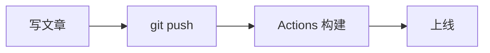

## 前言

**astro-koharu** 是一个基于 Astro 7 的现代化博客主题，设计灵感来自 Hexo 的 Shoka 主题，采用萌系/粉蓝配色。本文从零开始，带你完成博客的搭建、使用与写作。

---

## 一、项目下载与运行

### 环境要求

| 工具 | 版本要求 | 安装方式 |
|------|---------|---------|
| Node.js | >= 22.12.0 | [nodejs.org](https://nodejs.org) 或 `winget install OpenJS.NodeJS.LTS` |
| pnpm | >= 10.28.2 | `npm install -g pnpm` |

### 获取项目

```bash
# 克隆主题仓库
git clone https://github.com/cosZone/astro-koharu.git
cd astro-koharu

# 安装依赖
pnpm install
```

### 本地开发

```bash
pnpm dev
# 访问 http://localhost:4321
```

开发服务器支持热重载，修改文章或配置后浏览器自动刷新。

### 生产构建

```bash
pnpm build     # 构建到 dist/ 目录
pnpm preview   # 预览构建结果

pnpm check     # TypeScript 类型检查
pnpm lint      # Biome 代码检查
```

### 部署到 GitHub Pages

**第一步：创建 GitHub 仓库**

在 GitHub 上创建一个仓库，推荐命名为 `你的用户名.github.io`（用户站点）。

**第二步：配置 site.url**

编辑 `config/site.yaml`：

```yaml
site:
  url: https://你的用户名.github.io/  # 改为你的 Pages 地址
```

**第三步：创建 GitHub Actions 工作流**

在 `.github/workflows/deploy.yml`：

```yaml
name: Deploy to GitHub Pages
on:
  push:
    branches: [main]
jobs:
  build:
    runs-on: ubuntu-latest
    steps:
      - uses: actions/checkout@v4
      - uses: actions/setup-node@v4
        with:
          node-version: 22
      - uses: pnpm/action-setup@v4
      - run: pnpm install --frozen-lockfile
      - run: pnpm build
      - uses: actions/upload-pages-artifact@v3
        with:
          path: dist
  deploy:
    needs: build
    runs-on: ubuntu-latest
    environment:
      name: github-pages
    steps:
      - uses: actions/deploy-pages@v4
```

**第四步：启用 GitHub Pages**

1. 推送代码到 GitHub
2. 进入仓库 Settings → Pages → Source 选择 **GitHub Actions**
3. 以后每次 `git push` 都会自动构建部署

**第五步：撰写文章并发布**

```bash
# 在 src/content/blog/ 下编写 .md 文件
# 然后提交推送
git add -A
git commit -m "新文章"
git push
```

等待 1-2 分钟，Actions 构建完成后站点自动更新。

---

## 二、博客阅读指南

### 页面结构

```
首页 (/)              → 文章列表 + 精选分类 + 随机文章
├── 文章列表          → 分页展示所有已发布文章
├── 置顶文章          → sticky: true 的文章
├── 精选分类          → 按分类聚合的卡片
├── 随机文章          → 随机推荐 10 篇文章
└── 页脚              → 字数统计、文章数、标签

分类 (/categories)    → 按分类浏览文章
标签 (/tags)          → 按标签浏览文章
归档 (/archives)      → 时间线式浏览
友链 (/friends)       → 友情链接
关于 (/about)         → 关于页面
```

### 分类体系

文章按 `categories` 字段归类，当前博客使用以下分类：

| 分类 | 说明 | 路径 |
|------|------|------|
| 随笔 | 生活记录、年度总结 | `/categories/life` |
| 笔记 | 技术学习笔记 | `/categories/note` |
| 工具 | 工具使用指南 | `/categories/tools` |
| 周刊 | 定期更新的系列内容 | `/weekly` |

分类支持嵌套，如 `[笔记, 前端]` 会生成层级路径 `/categories/note/front-end`。

### 页面风格编辑

**基本配置** — `config/site.yaml`

```yaml
site:
  title: 你的博客名称        # 浏览器标签页标题
  alternate: your-blog       # Logo 显示的英文名
  subtitle: 副标题            # 站点副标题
  description: 博客简介        # 站点描述
  author: 你的名字            # 作者名
  avatar: /img/avatar.webp   # 替换你的头像
  url: https://你的域名.com/   # 站点域名
```

**替换头像**：将你的头像图片放到 `public/img/avatar.webp`。

**导航菜单**：

```yaml
navigation:
  - name: 首页
    path: /
    icon: fa6-solid:house-chimney
  - name: 文章
    icon: ri:quill-pen-ai-fill
    children:
      - name: 分类
        path: /categories
      - name: 标签
        path: /tags
      - name: 归档
        path: /archives
```

图标使用 [Iconify](https://icon-sets.iconify.design/) 格式。

**社交链接**：

```yaml
social:
  github:
    url: https://github.com/你的用户名
    icon: ri:github-fill
    color: "#191717"
  email:
    url: mailto:你的@邮箱.com
    icon: ri:mail-line
    color: "#55acd5"
  rss:
    url: /rss.xml
    icon: ri:rss-line
    color: "#ff6600"
```

**深色/浅色主题**：点击导航栏的太阳/月亮图标切换，自动记忆偏好。

**全站搜索**：点击搜索图标或按 `Cmd/Ctrl + K`，基于 Pagefind 无后端搜索，支持中文分词。

---

## 三、博客撰写指南

### 创建文章

**方式一：CLI（推荐）**

```bash
pnpm koharu new post
```

交互式输入标题、分类、标签等信息，自动生成文件。

**方式二：手动创建**

在 `src/content/blog/` 下创建 `.md` 文件，目录结构决定分类归属：

```plain
src/content/blog/
├── life/              # 随笔
│   └── my-post.md
├── note/              # 笔记
│   └── front-end/     # 笔记 > 前端（嵌套分类）
│       └── react.md
└── tools/             # 工具
    └── guide.md
```

### Frontmatter 字段

```yaml
---
title: 文章标题              # 必填
date: 2026-07-27            # 必填
description: 文章摘要         # SEO 推荐
link: custom-url-slug       # 自定义 URL（自动转小写）
cover: /img/cover/1.webp    # 封面图
tags:
  - 标签1
  - 标签2
categories:
  - 笔记                   # 单层分类
  # - [笔记, 前端]          # 嵌套分类
catalog: true               # 显示目录
tocNumbering: true          # 目录编号
draft: false                # 草稿模式
sticky: false               # 置顶
math: true                  # 启用 KaTeX 公式
quiz: true                  # 启用练习题
password: mySecret          # 整篇文章加密
updated: 2026-07-28         # 更新时间
---
```

### 标准 Markdown 语法

支持 GFM（表格、任务列表、删除线）以及 Mermaid 图表、KaTeX 数学公式：



行内公式 $E = mc^2$ 和块级公式：

$$
\int_{-\infty}^{\infty} e^{-x^2} dx = \sqrt{\pi}
$$

### Shoka 兼容特殊语法

主题从 Hexo Shoka 主题继承了一套丰富的 Markdown 扩展语法，所有功能均可在 `config/site.yaml` 的 `content` 中独立开关。

#### 文字特效

| 语法 | 效果 |
|------|------|
| `++下划线++` | 下划线文本 |
| `==高亮==` | 高亮文本 |
| `H~2~O` | 下标 |
| `E=mc^2^` | 上标 |
| `[红色]{.red}` | 颜色文字 |
| `[彩虹]{.rainbow}` | 彩虹渐变 |

#### 隐藏文字 (Spoiler)

```markdown
!!点击显示隐藏文字!!

!!鼠标悬停显示!!{.blur}
```

#### 注音标注 (Ruby)

```markdown
{漢字^かんじ}
{取り返す^とりかえす}
```

渲染为 HTML `<ruby>` 标签。

#### 提醒块

```markdown
:::info
信息提示内容
:::

:::warning
警告提示内容
:::

:::danger
危险操作提示
:::
```

支持：`default`、`primary`、`info`、`success`、`warning`、`danger`，加 `no-icon` 隐藏图标。

#### 折叠块

```markdown
+++primary 点击展开
折叠内容，支持 **Markdown** 格式化
+++

+++warning 注意事项
这里是一些注意点
+++
```

#### 标签卡 (Tabs)

````markdown
;;;mygroup JavaScript
```js
console.log('Hello');
```
;;;

;;;mygroup Python
```python
print('Hello')
```
;;;
````

#### 友链卡片

```markdown

- site: 博客名称
  url: https://example.com
  owner: 站长
  desc: 站点描述
  image: https://example.com/avatar.png
  color: '#ed788b'

```

#### 音视频播放器

```markdown

- name: 歌曲
  url: https://music.163.com/#/song?id=3339210292



- name: 视频
  url: https://example.com/video.mp4

```

#### 练习题

需在 frontmatter 设置 `quiz: true`。

```markdown
- 单选题？{.quiz}
  - 选项 A{.options}
  - 正确答案{.correct}
  - 选项 B{.options}

> 解析说明
```

支持单选、多选（加 `.multi`）、判断（加 `.true` 表示正确）、填空（`[答案]{.gap}`）。

#### 代码块增强

````markdown
```js title="hello.js" url="https://example.com" linkText="查看源码" mark:1,3
const greeting = 'Hello';
console.log(`${greeting}, World!`);
```

```bash command:("$":1-3)
npm install
npm run dev
```
````

| 元数据 | 说明 |
|--------|------|
| `title="文件名"` | 代码块标题 |
| `url="链接"` | 外部源码链接 |
| `mark:1,3` | 高亮指定行 |
| `command:("$":1-3)` | 标记命令行前缀 |

#### 数学公式

需在 frontmatter 设置 `math: true`。

```markdown
行内公式：$E = mc^2$

块级公式：
$$
\sum_{n=1}^{\infty} \frac{1}{n^2} = \frac{\pi^2}{6}
$$
```

#### 内容加密

**文章局部加密：**

```markdown
:::encrypted{password="demo"}
需要密码才能看到的内容
:::
```

**整篇文章加密：**

```yaml
---
title: 私密文章
password: mySecret
---
```

使用 AES-256-GCM 算法，密码不在客户端传递，加密内容不会被搜索索引收录。

---

## 四、Koharu CLI 工具

博客自带交互式 CLI：

```bash
pnpm koharu              # 交互式主菜单
```

### 常用命令

```bash
# 新建内容
pnpm koharu new          # 选择创建文章或友链
pnpm koharu new post     # 直接创建文章
pnpm koharu new friend   # 直接创建友链

# 备份与还原（更新主题前必备）
pnpm koharu backup           # 基础备份
pnpm koharu backup --full    # 完整备份（含图片）
pnpm koharu list             # 查看备份列表
pnpm koharu restore --latest # 还原最新备份

# 内容迁移
pnpm koharu migrate --dry-run  # 预览迁移计划

# 更新主题
pnpm koharu update           # 自动备份+拉取+合并
pnpm koharu update --check   # 仅检查更新
pnpm koharu update --clean   # 零冲突更新

# 生成内容资产
pnpm koharu generate lqips        # 图片占位符
pnpm koharu generate similarities # 相似度向量
pnpm koharu generate summaries    # AI 摘要
pnpm koharu generate all          # 全部生成
```

---

## 五、CMS 管理界面

```bash
pnpm cms:install    # 首次安装
pnpm cms            # 启动（默认 http://localhost:4322）
```

CMS 提供文章仪表盘、Web 编辑器、草稿/发布切换等功能。

---

## 六、常见问题

### 推送时 husky/lint-staged 报错

本地 Node.js 版本与 lockfile 不兼容时，husky pre-commit 会失败。使用 `--no-verify` 绕过：

```bash
git commit -m "消息" --no-verify
git push
```

### 构建时提示 Node.js 版本不支持

需使用 Node.js >= 22.12.0。在 Windows 上可通过 winget 升级：

```
winget install OpenJS.NodeJS.LTS
```

### 如何替换示例文章

`src/content/blog/` 下的示例文章可以直接删除或修改。删除后重新构建即可。

### 如何在首页隐藏某分类

在 `config/site.yaml` 中配置 `featuredSeries`，将高产出分类设为系列文章，自动从首页主列表分离。

---

## 总结

本文涵盖了 astro-koharu 博客的完整使用流程。总结几个关键点：

1. **日常写文章**：在 `src/content/blog/` 下创建 `.md` → `git push`
2. **改配置**：编辑 `config/site.yaml`
3. **更新主题前**：先 `pnpm koharu backup`
4. **图片优化**：添加新图片后运行 `pnpm koharu generate all` 并提交生成的 JSON

祝你写作愉快！
